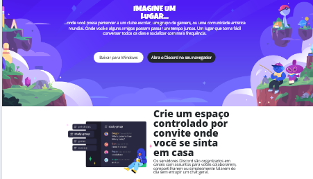

## 🧩 Funcionalidades

- Banner principal com chamada e dois botões de ação
- Quatro seções destacando benefícios da ferramenta
- Imagens descritivas e texto contextualizado
- Rodapé com logo
- Responsividade para telas pequenas com `@media` queries

## 📝 Observações

- O projeto utiliza fontes personalizadas: `Luckiest Guy` para títulos e `Open Sans` para textos.
- O layout pode ser expandido para **telas maiores** com mais media queries.
- As imagens estão referenciadas em uma pasta chamada `images/`.

## 📷 Preview

## 📌 Autor

Feito com dedicação por [Marcus](#) 🚀  
Inspirado no layout oficial do Discord para fins educacionais.

